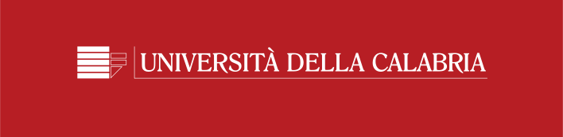
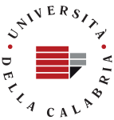
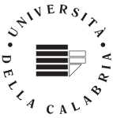

## Identità Visiva d'Ateneo

[Pagina ufficiale](https://www.unical.it/portale/ateneo/amministrazione/staffrettore/id_design/)

-----------

Loghi in formato svg pronti all'uso per il web.

| Nome          | anteprima     |
| ------------- |:-------------|
| loghi/logo1.svg |   |
| loghi/logo2.svg |   |
| loghi/logo3.svg |   |
| loghi/logo4.svg |   |
| loghi/logo5.svg |   |
| loghi/logo6.svg |   |
| loghi/logo7.svg |   |
| loghi/logo8.svg |   |
| loghi/logo9.svg |   |
| loghi/logo10.svg |   |
| loghi/logo11.svg |   |
| loghi/logo12.svg |   |
| loghi/logo13.svg |   |
| loghi/logo14.svg |   |
| loghi/logo15.svg |   |
